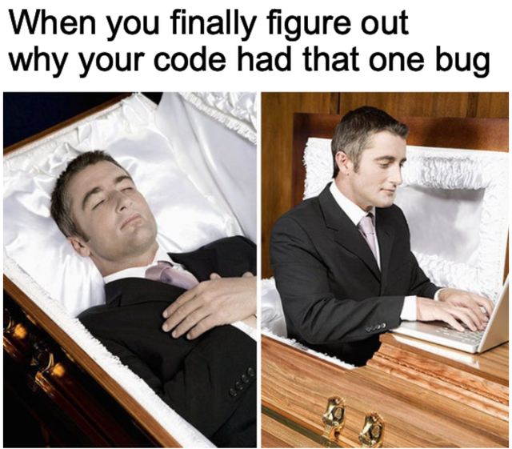

## `meirl` [📄](https://sourcevault.github.io/resume/)  / [🐤](https://twitter.com/sourcevault_) / [📧](mailto:joykrishnamondal@gmail.com)

<center>

</center>

```txt
🡒 Learn JS

🡒 find out javascript is a meme programming language.

🡒 dedicate life to JS.

🡒 be 2040, realize life's work was dedicated to a meme.

🡒 skynet gets written in a meme programming language anyway.

🡒 Skynet malfuctions because (0 == "") // true

🡒 Humanity saved due to galaxy brain level of technical debt.
```

```txt
🡒 - 1,000,000 LOC  + 10,000 LOC.

🡒 Make first million writing code, then first billion by deleting it.

🡒 using version control is admission that 1.0 will be bug ridden, so will 2.0, 3.0, 4.0 .... n.0
```

Programming is an artform, and just like analogue art, digital art thrives when it's set free 🦅.

Unlike other commodities, software creates it's own demand ( it's true for technology in general ).

Most people were not "demanding" Google / social networks before it became **operational** 🏃🏼‍♂️.

once you accept those economic realities, privateers who raise their 🏴‍☠️ in the name of the artform become formidable challengers .... this is the way 🧙🏼.

Most repos you browse ↓ here, you probably didn't realize you needed it ☺️.